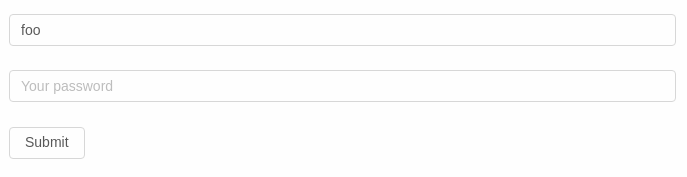

[English(WIP)](#)
# StateForm  
StateForm 定义了一个基于 JSON 的结构用来描述一个表单的状态(state), 同时定义了一些表单事件和内置组件. 借助相关实现, 你可以使用一个 json 对象来生成表单. 

目前它用于 [gateschema-form-vue](https://github.com/GateSchema/gateschema-form-vue) 和 [gateschema-form-react](https://github.com/GateSchema/gateschema-form-react) 中,  只需要传入一个 [GateSchema]() 即可得到一个带有验证功能的可用的表单  
## 状态(state) 
一个表单的状态使用一个树形的 json 对象来表示, 每一个节点  
* 至少包含一个 `component` 字段, 表示当前节点渲染成表单时所用的组件    
* 至少包含一个 `path` 字段, 表示当前节点的层级位置     
* 可能还有一个 `children` 字段, 包含了它的子节点  
* 可能包含布局相关的字段和组件特有的字段  

例子  
```json  
{
  "component": "Form",
  "path": "/",
  "cols": {
    "label": 0,
    "wrapper": 24
  },
  "children": [
    {
      "component": "Input",
      "path": "/name",
      "value": "foo"
    },
    {
      "component": "Input",
      "path": "/password",
      "type": "password",
      "placeholder": "Your password"
    }
  ],
  "value": {
    "name": "foo"
  }
}

```

上面的例子会生成下面这样的表单  

  

**更丰富的例子请看 [CodeSandbox](https://codesandbox.io/s/lx8q1143mz?module=%2Fsrc%2FformState.js)**


## 事件(event)  
StateForm 只有两个事件, 分别是 `input` 和 `submit`
###  `input`  
`input` 事件在用户在某个输入组件里输入了一个新值的时候触发, 告诉上层有新的输入, 外界可以相应地更新表单的 state. 事件触发时需要传入 3 个参数给外部处理函数, 分别是  
* path: 触发事件的组件 path 属性  
* value: 新的 value  
* index: 当组件的值是一个列表, 并且列表中的某个元素被删除时, 这个值为该元素的在列表中的索引值  

### `submit`  
当用户点击 `submit` 按钮时触发


## 内置组件(component)及其属性  
下面是几个基本接口  
```ts 
// 用于布局, 采用 24 格栅格布局系统 
type Cols = number | {
  span: number;
  offset: number;
}

interface FormItemCols {
  label: Cols;
  wrapper: Cols;
  xsLabel?: Cols;
  xsWrapper?: Cols;
  smLabel?: Cols;
  smWrapper?: Cols;
  mdLabel?: Cols;
  mdWrapper?: Cols;
  lgLabel?: Cols;
  lgWrapper?: Cols;
}

// 基本组件属性
interface FormItem {
  component: string,
  path: string;
  children?: FormItem[]

  hidden?: boolean;
  // css class
  class?: string | {
    [key: string]: boolean
  }

  layout?: "vertical" | "horizontal" | "inline";

  cols?: FormItemCols;

  label?: string;
  required?: boolean;
  placeholder?: string;
  help?: string;
  disabled?: boolean;
  //  当前组件的值
  value?: any;
  // 错误提示消息  
  error?: any;
}

```

### Form  
Form 是一个特殊的组件, StateForm 必须用 Form 组件作为根组件.  
它必须定义 `cols` 属性, 如果后代组件没有定义 `cols`, 那它将会使用根组件的 `cols`  
```ts  
interface Form {
  component: "Form";
  path: '/';
  children: FormItem[];
  cols: FormItemCols;
  submitCols?: FormItemCols;
  submitText?: string;
  showSubmit?: boolean;
}
```

### Input  
```ts  
interface Input extends FormItem {
  type?: 'text' | 'password';
  prepend?: string,
  append?: string
}
```
### Textarea  
```ts
interface Textarea extends FormItem{

}
```

### DatePicker  
```ts
interface DatePicker extends FormItem {
  // 指定用户输入时, 给上层返回的值的类型
  valueType?: "iso" | "second" | "millisecond";
  // 指定显示时使用的格式  
  // 注意, 不同的实现, 可能会有差异
  format?: string;
}
```
### DateTimePicker  
```ts
interface DateTimePicker extends FormItem {
  valueType?: "iso" | "second" | "millisecond";
  format?: string;
}
```
### Upload  
```ts
interface Upload extends FormItem {
  // 已上传文件的显示风格
  listType?: "text" | "picture";
  // 上传按钮的文字
  uploadText?: string;
}
```
### UploadList 
```ts
interface UploadList extends FormItem {
  listType?: "text" | "picture" ;
  uploadText?: string;
}
```
### InputNumber  
```ts
interface InputNumber extends FormItem {
}
```
### Switch  
用于接收和显示 `boolean` 类型的值, 例如 开启/关闭  
```ts
interface Switch extends FormItem {
}
```

### BoolCheck  
同 `Switch` 组件一样, 用于接收和显示 `boolean` 类型的值, 但是它使用一个 `Checkbox` 来显示
```ts
interface BoolCheck extends FormItem {
  content?: string
}
```

### Map  
用户接收 `Map` 类型的输入, 类似表单"嵌套"  
```ts
interface Map extends FormItem {
}
```

### List  
```ts
interface List extends FormItem {
  showAddButton?: boolean;
  AddText?: string;
}
```

### Radio, Checkbox, Select  
```ts
type Option =
  | string
  | {
    [key: string]: any;
  };

interface Radio extends FormItem {
  option: Option;
  disabledItems: {
    [key: string]: boolean
  };
}

interface Checkbox extends FormItem {
  option: Option;
  disabledItems: {
    [key: string]: boolean
  };
}

interface Select extends FormItem {
  multiple?: boolean;
  option: Option;
  disabledItems: {
    [key: string]: boolean
  };
}
```

## Example  
[](https://codesandbox.io/s/lx8q1143mz?module=%2Fsrc%2FformState.js)

## Implementation    
* [stateform-iview](https://github.com/stateform/stateform-iview)  
* [stateform-antd](https://github.com/stateform/stateform-antd)

## License  
Apache 2.0